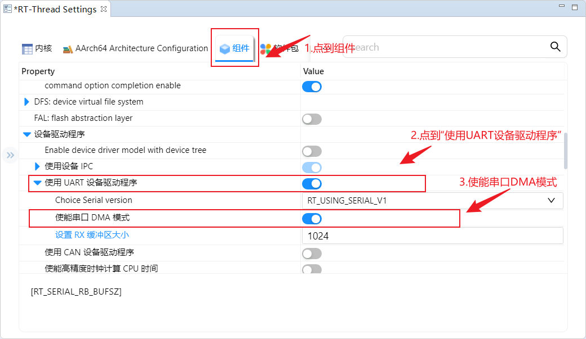
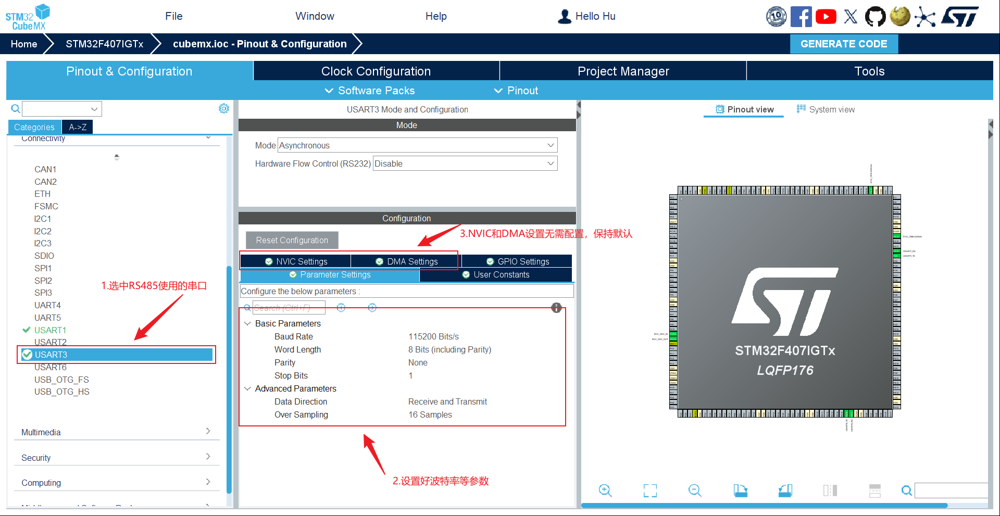
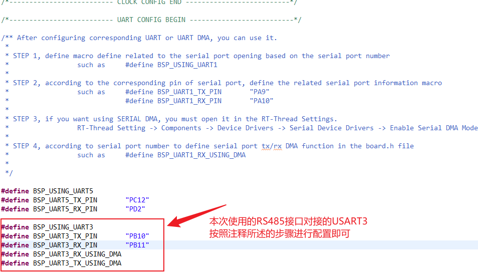
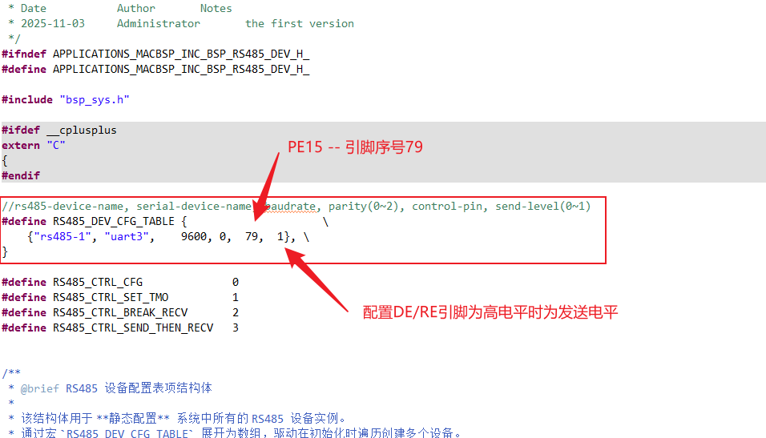
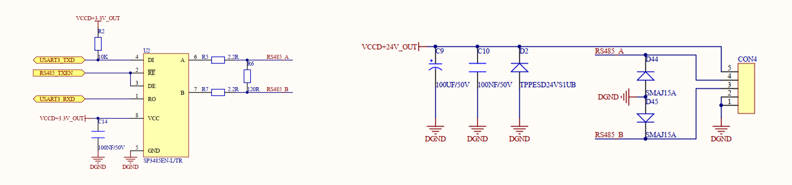

```bash
create_at：2025/11/13
aliases：验证RS485硬件接口与软件驱动
IDE：RT-Thread Studio v2.2.9 或更高版本
RTT 版本：v4.1.0 或更高（支持 DMA 驱动）
芯片：STM32F407IGT6
硬件：串口引脚已连接（e.g., UART3: PB10-TX, PB11-RX）
```


# <font size=4>RTT配置串口DMA模式收发</font>
## <font size=3>一、RT-Thread Settings配置</font>
<font size=2>

- 双击工程根目录下的 RT-Thread Setting（或在菜单中打开）
- 依次点击 `"组件"` > `"设备驱动程序"` > `"使用UART设备驱动程序"` > `"Choice Serial version" , 选择RT_USING_SERIAL_V1` > `使能串口DMA模式（勾选上）` > `设置RX缓冲区大小（1024）`



</font>

---


## <font size=3>二、CubeMX配置</font>
<font size=2>

- 设置RCC时钟源，`High Speed Clock` > `Crystal/Ceramic Resonator`
- 设置串口，本次测试电路RS485与USART3对接，`USART3`> `参数保持默认`




</font>


---

## <font size=3>三、代码配置</font>
<font size=2>

- 到`board.h`文件中增加USART串口的配置宏定义



---

- 本次测试电路使用的485芯片型号是`SP3485EN-L/TR`，使用软件控制SP3485的DE引脚来控制发送方向，该芯片设置DE为高电平时，向外发送。



</font>

---


## <font size=3>四、硬件原理图</font>
<font size=2>

- 硬件原理图如下所示




</font>